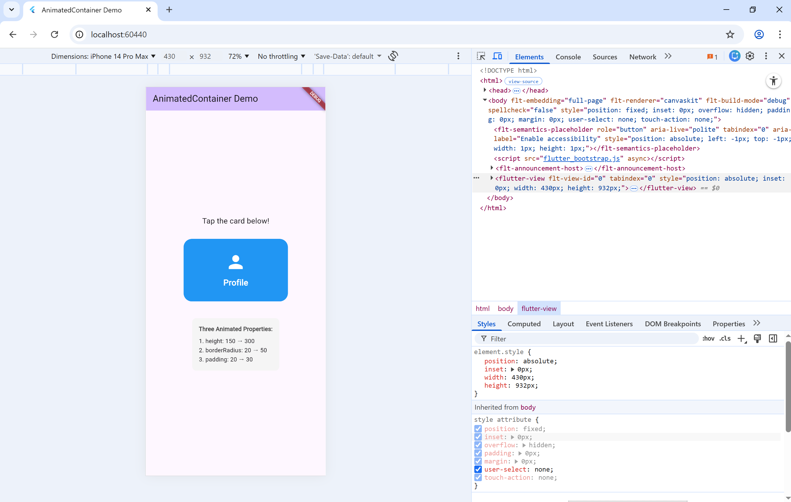

# A Flutter AnimatedContainer Demonstration

## Summary
An expandable profile that serves as a Flutter example of how to animate properties of an AnimatedContainer.

## Description
Using an AnimatedContainer in a real-world example to create an expandable profile card, which is consistent with how social media apps and contact management systems work.

## Important Properties Demonstrated

### Height
- Function: Determines the height of the AnimatedContainer.
- Implementation: Animate container from 150 (collapsed) to 300 (expanded).
- Visual effect: Display additional detail to user.

### Decoration
- Function: Determine how the AnimatedContainer visually looks, for example, with border styles.
- Implementation: Starting with a border radius of 20, animate to a border radius of 50 and change the color from blue to dark purple.
- Visual effect: Smooth transition when the animated container color changes and becomes more circular.

### Padding
- Function: Determines the amount of space between the border of the AnimatedContainer and the content that is already in the AnimatedContainer.
- Implementation: Animate from EdgeInsets.all(20) to EdgeInsets.all(30).
- Visual effect: Provide more spacing, resulting in ease of viewing content within the AnimatedContainer.

## How to Get Started

## Setup Requirements:
- Flutter SDK ([Install Documentation](https://docs.flutter.dev/get-started/install)) installed
- IDE (Visual Studio Code, Android Studio, or IntelliJ Idea)
- Emulation of Android/iOS, physical device, or simulator available

## To perform this demo:
1. Clone source code:
```bash
git clone https://github.com/Songa7273/Widget.git
cd Widget
```
2. Pull dependencies:
```bash
flutter pub get
```
3. Launch app:
```bash
flutter run
```
4. Click on the profile card to demonstrate an `AnimatedContainer` effect.

Screenshot





_The picture demonstrates both the collapsed state and extended state profile cards through an `AnimatedContainer`._

# Code Layout

lib/main.dart holds all code for this demonstration.
The `AnimatedContainer` is created in the `_ProfileCardDemoState` build() method of that file.
The attributes that will utilize the `AnimatedContainer` – height, decoration and padding – are managed via a single boolean state called `_isExpanded`.

## Features

- ✅ Smooth, 500 ms animated transition time with an easeInOut animation curve.
- ✅ A realistic example of expanding profile card UI pattern.
- ✅ A clear demonstration of three attributes of `AnimatedContainer`.
- ✅ Simple and easy to read (less than 150 lines of code).
- ✅ A reference showing the change of animated attribute values.

## Learning

- The **AnimatedContainer** widget automatically animates any property that has a duration when the value for that property changes.
- Duration property is how long an animation will run for.
- Animation curve property defines how fast or slow an animation will increase or decrease in speed while running.
- Any type of property that can be interpolated linearly can be animated.
- Using all animated properties together makes a fully functional and fluid experience. 

## Author

Created as a Flutter widget assignment.

## License

This project is open source and available for educational use.


